# Machine Learning for Cyber Security cook book code

By Alexander Ospenko and Yasir Ali

# Chapter 1 Machine Learning for Cybersecurity

### Train test Splitting your data

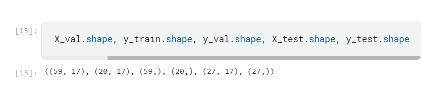

### Standardizing your data

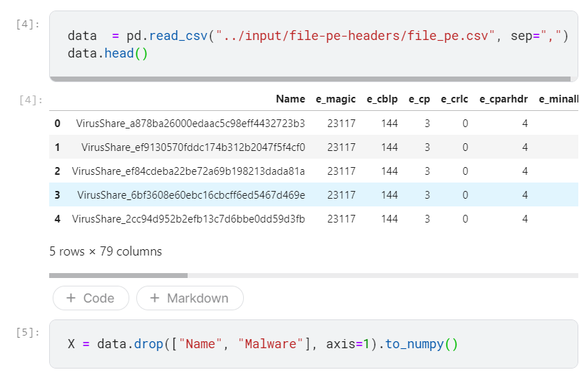

### Principal Component Analysis

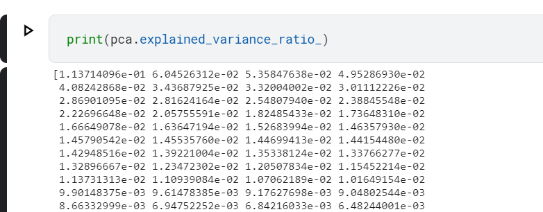

### Generating text using Markov Chains

Markov chains are simple stochastic models in which a system can exist in a number of
states. To know the probability distribution of where the system will be next, it suffices to
know where it currently is.

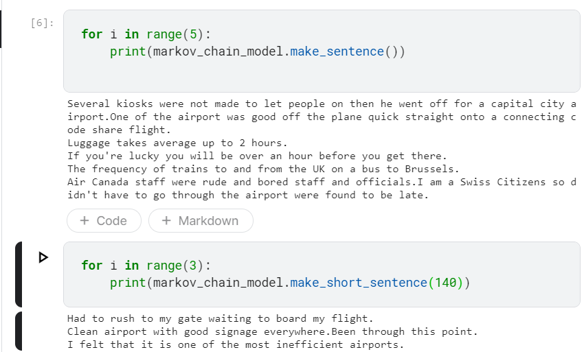

### Performing Clustering algorithms

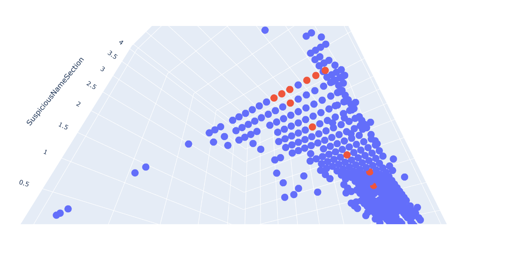

### Training an XGBoost Classifier

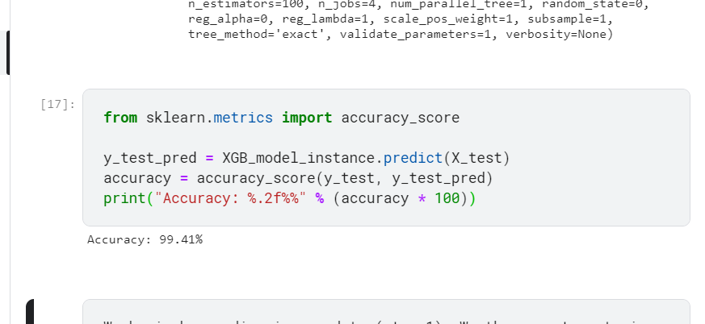

### Analysing time series using statsmodels

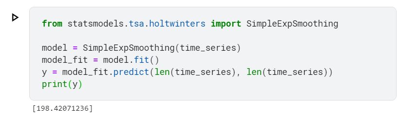

### Anomaly detection with Isolation Forest

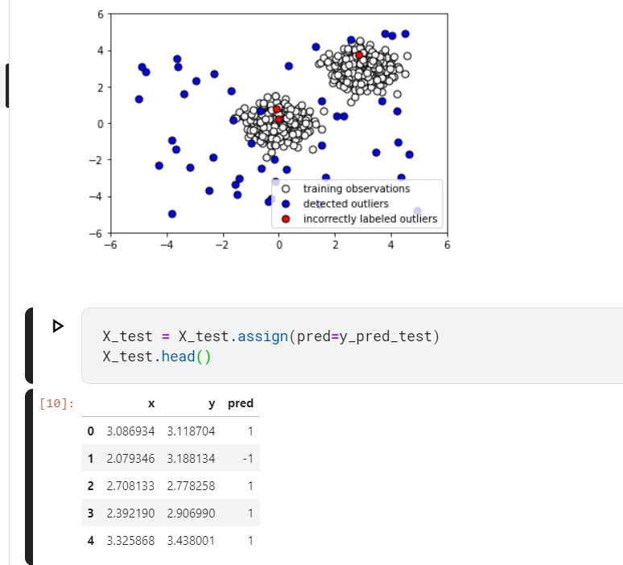

### Natural language processing using a hashing vectorizer and if-idf with scikit learn

A token is a unit of text. For example, we may specify that our tokens are words, sentences,
or characters. A count vectorizer takes textual input and then outputs a vector consisting of
the counts of the textual tokens. A hashing vectorizer is a variation on the count vectorizer
that sets out to be faster and more scalable, at the cost of interpretability and hashing
collisions. Though it can be useful, just having the counts of the words appearing in a
document corpus can be misleading. The reason is that, often, unimportant words, such as
the and a (known as stop words) have a high frequency of occurrence, and hence little
informative content. For reasons such as this, we often give words different weights to
offset this. The main technique for doing so is tf-idf, which stands for Term-Frequency,
Inverse-Document-Frequency. The main idea is that we account for the number of times a
term occurs, but discount it by the number of documents it occurs in

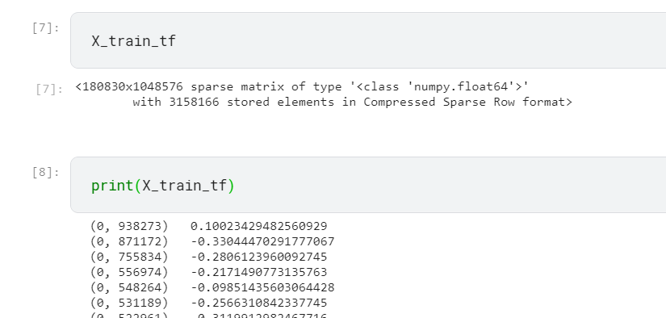

### Hyper parameter tuning with scikit optimize

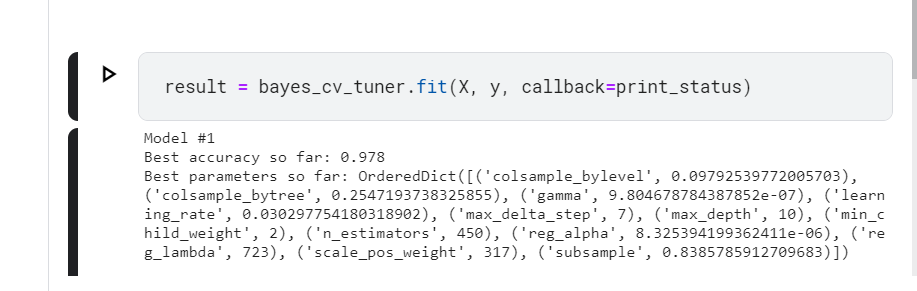

Page 57

# Chapter 2 Machine Learning Based Malware Detection

### Malware Static Analysis

It can be name or yara.

1. comparing and finding out the hash value

2. Looking at YARA rules

3. Looking at section headers

4. Looking at feature sections

### Malware dynamic analysis

Unlike static analysis, dynamic analysis is a malware analysis technique in which the expert
executes the sample, and then studies the sample's behavior as it is being run. The main
advantage of dynamic analysis over static is that it allows you to bypass obfuscation by
simply observing how a sample behaves, rather than trying to decipher the sample's
contents and behavior.

Malware can be analysed by setting up a cuckoo sandbox

### using machine learning to detect the file type

to curate a dataset we will scrape github
Shows the function of pyGithub

Be careful with the github password while doing this exercise!

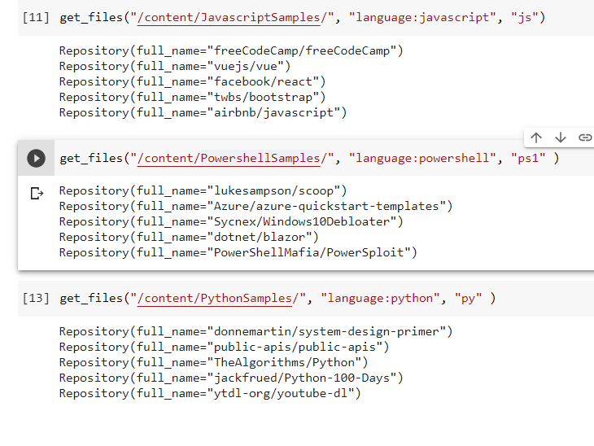

code at : https://colab.research.google.com/drive/1wDGTqMpLKzwpIpczMGu3YIqICq8_a6oO#scrollTo=Fo2GZzhmxQ73

File classifier made :

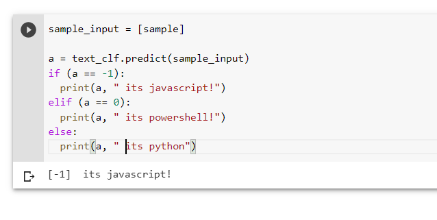

### Measuring similarity between two strings

To check whether two files are identical, we utilize standard cryptographic hash functions,
such as SHA256 and MD5. However, at times, we would like to also know to what extent
two files are similar. For that purpose, we utilize similarity hashing algorithms. The one we
will be demonstrating here is ssdeep

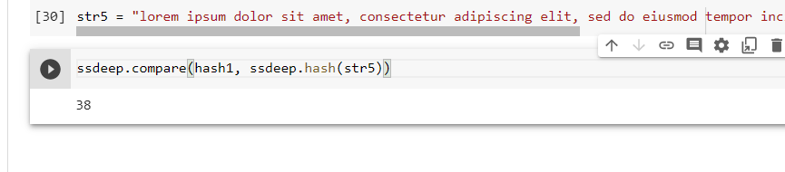

Not very useful I feel, but only channging one letter the score comes down to 30

### Measuring similarity between two files

adding a null character at the end creates the following change

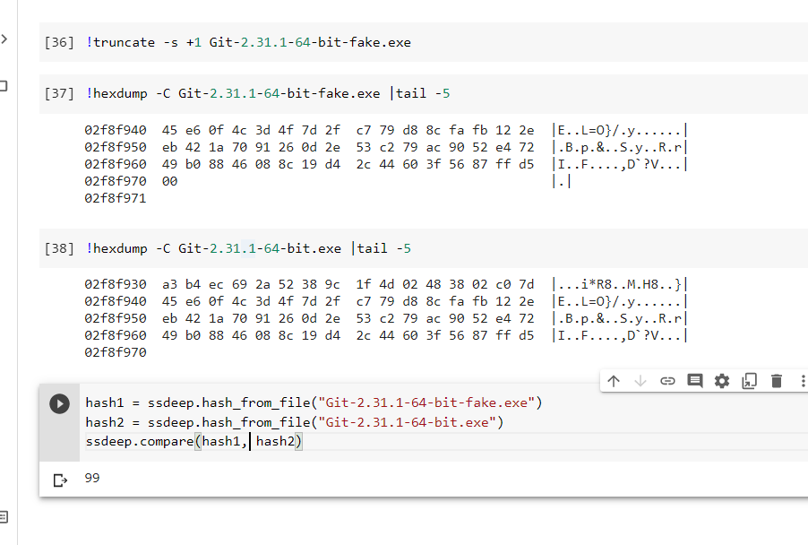

### Extracting N-grams

n the 1-grams are the, quick, brown, fox, jumped, over, the, lazy, and
dog. The 2-grams are the quick, quick brown, brown fox, and so on. The 3-grams are the quick
brown, quick brown fox, brown fox jumped, and so on

Just like the local statistics of the text
allowed us to build a Markov chain to perform statistical predictions and text generation
from a corpus, N-grams allow us to model the local statistical properties of our corpus.

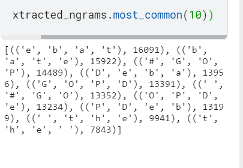

### Selecting the best N-grams

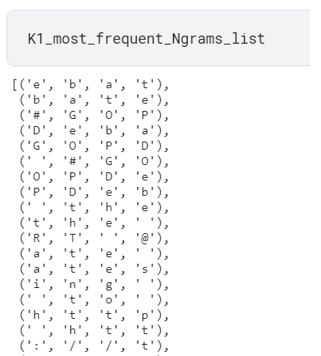

First we had to download all the PE files

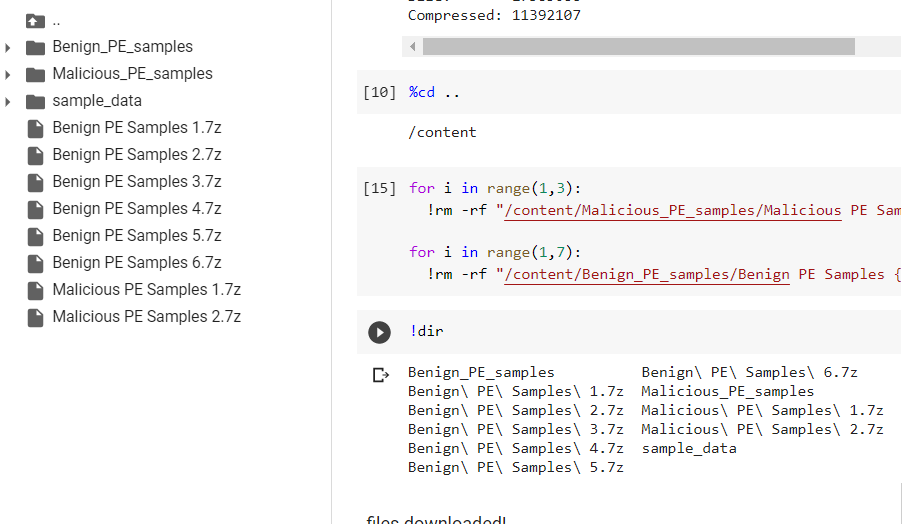

https://colab.research.google.com/drive/1sgT5VSlxcthkCXlzN30eUibU3HvPOG6v#scrollTo=qwbZ6zaRsH1v

### Selecting the best N grams

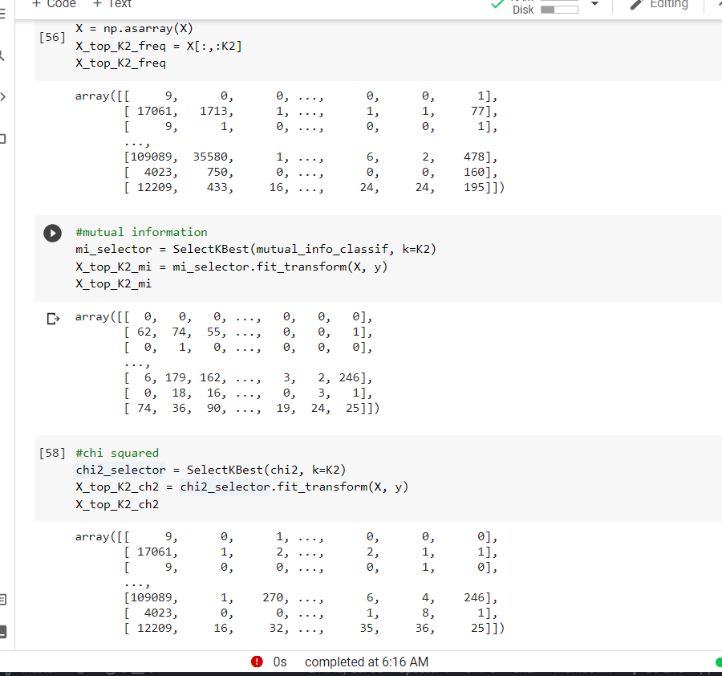

### Building a static malwre detector

classifier:

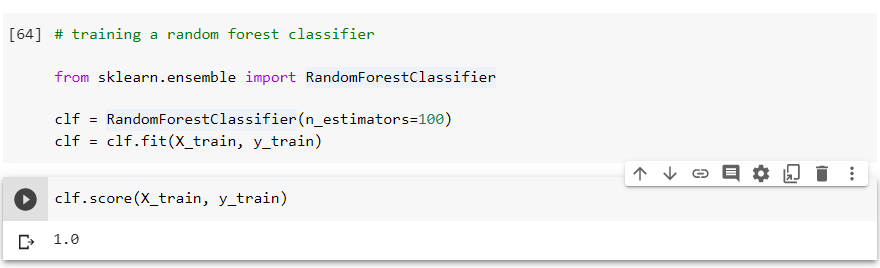

### Tackling class imbalance

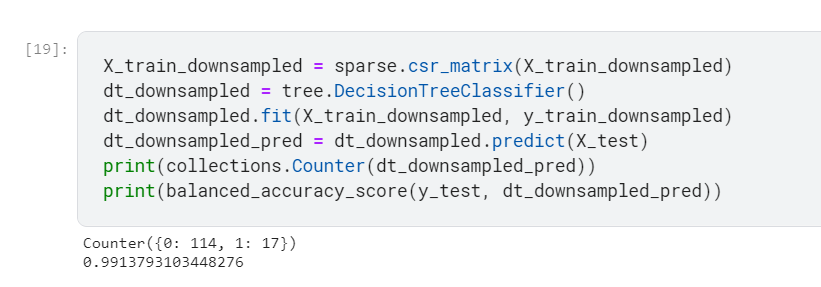

### Handling type 1 and type 2 errors

In many situations in machine learning one type of error might be more important thatn other

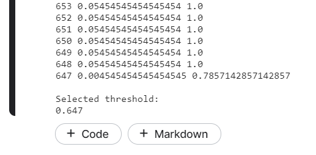

Often in applying machine learning to cybersecurity, we are faced with highly imbalanced
datasets. For instance, it may be much easier to access a large collection of benign samples
than it is to collect malicious samples. Conversely, you may be working at an enterprise
that, for legal reasons, is prohibited from saving benign samples

# Chapter 3 Advanced Malware Detection

We would be working with following recipes

1. detecting obfuscated Javascript
2. Featurizing PDF files
3. Extracting Ngrams quickly by using hash-gram algorithm
4. Building a dynamic malware classifier
5. MalConv -  end to end deep learning for malicious PE detection
6. using packers
7. Assembling a pcked sample dataset
8. Building a classifier for packers
9. MalGAN
10. Tracking malware drift

### Javascript Obfuscated files

https://www.kaggle.com/fanbyprinciple/javascript-obfuscation-detection/edit

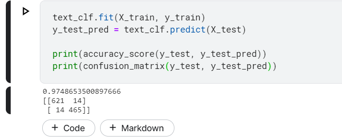

page 107

