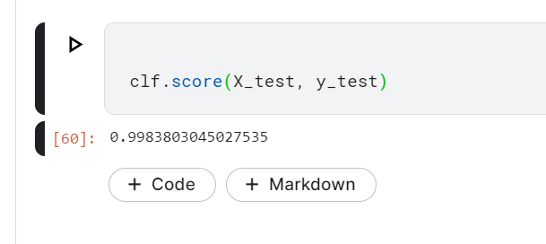

# Machine Learning for Cyber Security cook book code

By Alexander Ospenko and Yasir Ali

# Chapter 1 Machine Learning for Cybersecurity

### Train test Splitting your data

### Standardizing your data

### Principal Component Analysis

### Generating text using Markov Chains

Markov chains are simple stochastic models in which a system can exist in a number of
states. To know the probability distribution of where the system will be next, it suffices to
know where it currently is.

### Performing Clustering algorithms

### Training an XGBoost Classifier

### Analysing time series using statsmodels

### Anomaly detection with Isolation Forest

### Natural language processing using a hashing vectorizer and if-idf with scikit learn

A token is a unit of text. For example, we may specify that our tokens are words, sentences,
or characters. A count vectorizer takes textual input and then outputs a vector consisting of
the counts of the textual tokens. A hashing vectorizer is a variation on the count vectorizer
that sets out to be faster and more scalable, at the cost of interpretability and hashing
collisions. Though it can be useful, just having the counts of the words appearing in a
document corpus can be misleading. The reason is that, often, unimportant words, such as
the and a (known as stop words) have a high frequency of occurrence, and hence little
informative content. For reasons such as this, we often give words different weights to
offset this. The main technique for doing so is tf-idf, which stands for Term-Frequency,
Inverse-Document-Frequency. The main idea is that we account for the number of times a
term occurs, but discount it by the number of documents it occurs in

### Hyper parameter tuning with scikit optimize

Page 57

# Chapter 2 Machine Learning Based Malware Detection

### Malware Static Analysis

It can be name or yara.

1. comparing and finding out the hash value

2. Looking at YARA rules

3. Looking at section headers

4. Looking at feature sections

### Malware dynamic analysis

Unlike static analysis, dynamic analysis is a malware analysis technique in which the expert
executes the sample, and then studies the sample's behavior as it is being run. The main
advantage of dynamic analysis over static is that it allows you to bypass obfuscation by
simply observing how a sample behaves, rather than trying to decipher the sample's
contents and behavior.

Malware can be analysed by setting up a cuckoo sandbox

### using machine learning to detect the file type

to curate a dataset we will scrape github
Shows the function of pyGithub

Be careful with the github password while doing this exercise!

code at : https://colab.research.google.com/drive/1wDGTqMpLKzwpIpczMGu3YIqICq8_a6oO#scrollTo=Fo2GZzhmxQ73

File classifier made :

### Measuring similarity between two strings

To check whether two files are identical, we utilize standard cryptographic hash functions,
such as SHA256 and MD5. However, at times, we would like to also know to what extent
two files are similar. For that purpose, we utilize similarity hashing algorithms. The one we
will be demonstrating here is ssdeep

Not very useful I feel, but only channging one letter the score comes down to 30

### Measuring similarity between two files

adding a null character at the end creates the following change

### Extracting N-grams

n the 1-grams are the, quick, brown, fox, jumped, over, the, lazy, and
dog. The 2-grams are the quick, quick brown, brown fox, and so on. The 3-grams are the quick
brown, quick brown fox, brown fox jumped, and so on

Just like the local statistics of the text
allowed us to build a Markov chain to perform statistical predictions and text generation
from a corpus, N-grams allow us to model the local statistical properties of our corpus.

### Selecting the best N-grams

First we had to download all the PE files

https://colab.research.google.com/drive/1sgT5VSlxcthkCXlzN30eUibU3HvPOG6v#scrollTo=qwbZ6zaRsH1v

### Selecting the best N grams

### Building a static malwre detector

classifier:

### Tackling class imbalance

### Handling type 1 and type 2 errors

In many situations in machine learning one type of error might be more important thatn other

Often in applying machine learning to cybersecurity, we are faced with highly imbalanced
datasets. For instance, it may be much easier to access a large collection of benign samples
than it is to collect malicious samples. Conversely, you may be working at an enterprise
that, for legal reasons, is prohibited from saving benign samples

# Chapter 3 Advanced Malware Detection

We would be working with following recipes

1. detecting obfuscated Javascript
2. Featurizing PDF files
3. Extracting Ngrams quickly by using hash-gram algorithm
4. Building a dynamic malware classifier
5. MalConv -  end to end deep learning for malicious PE detection
6. using packers
7. Assembling a pcked sample dataset
8. Building a classifier for packers
9. MalGAN
10. Tracking malware drift

### Javascript Obfuscated files

https://www.kaggle.com/fanbyprinciple/javascript-obfuscation-detection/edit

dataset at : https://www.kaggle.com/fanbyprinciple/obfuscated-javascript-dataset

page 107

### Featurizing PDF files

is the PDFiD Python script designed by Didier Stevens
(https://blog.didierstevens.com/). Stevens selected a list of 20 features that are
commonly found in malicious files, including whether the PDF file contains JavaScript or
launches an automatic action. It is suspicious to find these features in a file, hence, the
appearance of these can be indicative of malicious behavior.

Google colab link: https://colab.research.google.com/drive/1aDEU2OTZIoqSLIlZxGPStAhPQnPLSOHm#scrollTo=0DtzUxJA58Uh

### Extracting N-grams quickly using the hash gram algorithm

We will extract the most common ngrams efficiently.

https://www.kaggle.com/fanbyprinciple/quick-guide-to-creating-creating-hashgrams/edit

### Dynamic analysis

PAGE 119

### MalConv building an end to end deep learning for malicous PE detection

if we cimpletely skip feature engineering , we simply feed a stream of raw bytes to the neural network.

No able to run the notebook here.

https://www.kaggle.com/fanbyprinciple/malconv-end-to-end-malware-detection/edit

### Tackling packed malware

running upx for packing and unpacking files

https://www.kaggle.com/fanbyprinciple/tackling-packed-malware/edit

### creating Malgan

It is not working

![])img/ch3_malgan.png)

### malware time drift

# Ch4 Machine Learning for Social Engineering

page 139

### Twitter spear phishing bot

In this recipe, we are going to use machine learning to build a Twitter spear phishing bot.
The bot will utilize artificial intelligence to mimic its targets' tweets, hence creating
interesting and enticing content for its own tweets. Also, the tweets will contain embedded
links, resulting in targets clicking these phishing links. Of course, we will not be utilizing
this bot for malicious purpose, and our links will be dummy links. The links themselves
will be obfuscated, so a target will not be able to tell what is really hidden behind them
until after they click.
Experimentally, it has been shown that this form of attack has a high percentage success
rate, and by simulating this form of attack, you can test and improve the security posture of
your client or organization

### Voice impersonation

Using the new technology of voice style transfer via neural networks, it is becoming easier
and easier to convincingly impersonate a target's voice. In this section, we show you how to
use deep learning to have a recording of a target saying whatever you want them to say, for
example, to have a target's voice used for social engineering purposes or, a more playful
example, using Obama's voice to sing Beyoncé songs. We selected the architecture in
mazzzystar/randomCNN-voice-transfer that allows for fast results with high quality.
In particular, there is no need to pre-train the model on a large dataset of recorded audio

### Speech recognition

### Face Recognition

### Deep fake example

### Deep fake recognition

### Lie detector

It is actually a flask app. Need to look into it later.

### Personality insight IBM

NO authenticator error. And Personalityinsight is being discontinued.

### Social mapper

We would be using somehting liek Greenwolf social mapper

Using social mapper you can look at the teh person web footprint

### Fake review generator

### Fake news classification

created a dataset :https://www.kaggle.com/fanbyprinciple/fake-news-dataset

# Ch5 Penetration Testing Using Machine Learning

### CAPTCHA breaker

A CAPTCHA is a system intended to prevent automated web scraping

We will be creating a captcha dataset

The dataset: https://www.kaggle.com/fanbyprinciple/captcha-images/code

https://www.kaggle.com/fanbyprinciple/captcha-solver/edit

CAPTCHA solver works!

## Neural Network assisited fuzzing

Most popular fuzzers, while effective in some limited situations, often get stuck in a loop.
Gradient-based methods, such as the one discussed here, are promising but do not clearly
apply to the problem, because real-world program behaviors are not necessarily smooth
functions (for example, they can be discontinuous). The idea behind NEUZZ is to
approximate the program's behavior as a smooth function using neural networks. Then, it
is possible to apply gradient methods to improve fuzzing efficiency. We start our recipe by
compiling NEUZZ (step 1). The funroll-loops flag causes the compiler to unroll loops
whose number of iterations can be determined at compile time or upon entry to the loop.
As a result, the code is larger, and may run faster, although not necessarily. Continuing to
setup NEUZZ, we add in 32-bit support (step 2). We set the CPU scaling algorithm and core
dump notification (step 3); the CPU frequency scaling is a setting that enables the OS to save
power by scaling the CPU frequency up or down. In the next two steps, we simply place
the files in a convenient location and allow permissions to execute them. We are done
setting up NEUZZ. We can now use it to find inputs that cause programs to crash. In step 6
and step 7, we begin the search for crashes using our neural network. After waiting a 
sufficient amount of time for step 6 and step 7 to gather enough inputs to cause the readelf
tool to crash, we execute one of these inputs (step 8) to see the result. Indeed, we see that the
input resulted in readelf crashing.

## DeepExploit

DeepExploit is a penetration testing tool that elevates Metasploit to a whole new level by
leveraging AI. Its key features are as follows:

Deep penetration: If DeepExploit successfully exploits the target, it will
automatically execute the exploit to other internal servers as well. 

Learning: DeepExploit is a reinforcement learning system, akin to AlphaGo.

The model utilizes the Asynchronous Actor-Critic Agents (A3C)
algorithm, released by Google's DeepMind group a few years back, famous for 
outperforming the deep Q-network (DQN) approach. Next, we test our model (step 12) and
print out the results of its analysis in a report (step 13). As you can see from the long report,
a large number of vulnerabilities were found by DeepExploit. Speaking from a high level,
the application of reinforcement learning to penetration testing suggests that extremely
efficient automated penetration testing is on the horizon.

## Web server vulnerability scanner using machine learning (GyoiThon)

GyoiThon is an intelligence-gathering tool for web servers. It executes remote access to a
target web server and identifies products operated on the server, such as the Content
Management System (CMS), web server software, framework, and programming
language.

In addition, it can execute exploit modules for the identified products using
Metasploit. 

## Deanonymizing Tor using machine learning

Tor is a free, open source software for enabling anonymous communication. In addition,
websites accessible only when using the Tor browser exist, and are part of the dark web
ecosystem – the name given to the part of the internet that is hidden from the average user.
In this recipe, we will deanonymize Tor traffic by collecting enough features and
information from individual sessions to be able to identify the activity of anonymized
users. This recipe utilizes the conmarap/website-fingerprinting repository

## IoT device type identification using machine learning

With the advent of IoT, the attack surfaces on any given target have increased
exponentially. With new technology comes new risks, and, in the case of IoT, one such risk
to an organization is the addition of a malicious IoT device connected to the organization's
network. It is essential to be able to tell when such a device has been added to a network
and to understand its nature. In this recipe, we'll build a machine learning model to classify
network IoT devices by type

## Keystroke dynamics

Keystroke dynamics, aka typing biometrics, is the study of recognizing a person by the way
they type. One important use case is recognizing which user is logging in using a given
credential, for example, who is logging in as root? Another use case is recognizing when a
different user has typed a sequence of keystrokes. In this recipe, we'll show how to use a
machine learning-based keystroke dynamics algorithm

How it works...

Analyzing keystroke dynamics utilizes the rhythm and pace at which a user types on a
keyboard to verify that individual's identity. We begin by setting up some baselines. In step
1 and step 2, we set up the keystroke dynamics system to learn the typing pattern of the first
user. We then do the same for the second user (step 3). This establishes our normal users, as
well as their typing patterns. In step 4 and step 5, we utilize our trained model (trained in
steps 1-3), to determine who the current user is. As you can see, the classifier outputs a
similarity score and a prediction of who the current user is from its catalog of saved users.
This allows us to detect unauthorized users, as well as to simply keep track of system
usage

## Malicious URL detector

Malicious URLs cause billions of dollars of damage every year by hosting spam, malware,
and exploits, as well as stealing information. Traditionally, defenses against these have
relied on blacklists and whitelists – lists of URLs that are considered malicious, and lists of
URLs that are considered safe. However, blacklists suffer from a lack of generality and an
inability to defend against previously unseen malicious URLs. To remedy the situation,
machine learning techniques have been developed. In this recipe, we'll run a malicious URL
detector using character-level recurrent neural networks with Keras. The code is based on
https://github.com/chen0040/keras-malicious-url-detector.

## Deep-pwning

Deep-pwning is a framework for evaluating the robustness of machine learning tools
against adversarial attacks. It has become widely known in the data science community that
naive machine learning models, such as deep neural networks trained with the sole aim of
classifying images, are very easily fooled.

## Deep learning-based system for the automatic detection of software vulnerabilities

Experts in information security can usually identify potentially exploitable pieces of code.
Yet, the work is intensive and costly, and may not be sufficient to make a program secure.
One of the great advantages of deep learning over traditional machine learning is that
features can be automatically discovered. This allows us to alleviate the need for a human
expert on vulnerabilities, as well as to produce more effective systems. In this recipe, we'll
utilize a modified version of VulDeePecker : A Deep Learning-Based System for Vulnerability
Detection (https://arxiv.org/pdf/1801.01681.pdf), to automatically detect buffer error
vulnerabilities and resource management errors in C/C++ software.

# ch6 Automatic Intrusion Detection

## Spam filtering using machine learning

